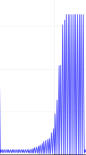

# Data Logger (and using cool sensors!)

*A lab report by Brian Pfaff*

## The Report

## Part A.  Writing to the Serial Monitor
 
**a. Based on the readings from the serial monitor, what is the range of the analog values being read?**
 
 The range is 0 to 1023.
 
**b. How many bits of resolution does the analog to digital converter (ADC) on the Arduino have?**

10 bits of resolution.

## Part B. RGB LED

**How might you use this with only the parts in your kit? Show us your solution.**

We could connect two of the 225 ohm resistors in series to the red pin in order to give it a higher resistance than the blue and green pins where we would only connect one 225 ohm resistor.


## Part C. Voltage Varying Sensors 
 
### 1. FSR, Flex Sensor, Photo cell, Softpot

**a. What voltage values do you see from your force sensor?**

The Force sensore gave the full range of voltages, 0-1023 bits so 0-5V

**b. What kind of relationship does the voltage have as a function of the force applied? (e.g., linear?)**

The relationship is not linear, it is more of a log function with a very fast increase in voltage with minimal force applied however harder the you push, the less the gain in voltage is. 

**c. Can you change the LED fading code values so that you get the full range of output voltages from the LED when using your FSR?**

Yes, I put if statements in the loop with each of them corresponding to a different color in the range of the sensor. 
``` 
void loop()
{
  a_read = analogRead(A0);
  if (a_read <100){
  setColor(255, 0, 0);
  }
  if (a_read> 100 && a_read<250) {
  setColor(0, 255, 0);  // green
  }
  if (a_read>250 && a_read<500) {
  setColor(0, 0, 255);  // 
  }
  if (a_read> 500 && a_read<900) {
  setColor(80, 0, 80);  // 
  }
  if (a_read> 900) {
  setColor(0, 255, 255);  // aqua
  }
}
```

**d. What resistance do you need to have in series to get a reasonable range of voltages from each sensor?**

Force Sensor: 10k worked

Flex: 10k worked

Photo Cell: 10k worked for a reasonable range however I was not able to get the full range with it 

Softpot: 

**e. What kind of relationship does the resistance have as a function of stimulus? (e.g., linear?)**

Force Sensor: log

Flex: log

photo cell: linear

softpot: 

### 2. Accelerometer
 
https://github.com/bripfaff/IDD-Fa18-Lab3/blob/master/Accel_Code.ino

### 3. IR Proximity Sensor

**a. Describe the voltage change over the sensing range of the sensor. A sketch of voltage vs. distance would work also. Does it match up with what you expect from the datasheet?**

The proximity sensor follows an exponential read out as we approach it. As seen below on the graph as you get closer and closer it starts to quickly increase its read out of proximity. 
 



**b. Upload your merged code to your lab report repository and link to it here.**

[Reading Both Sensors Code](https://github.com/bripfaff/IDD-Fa18-Lab3/blob/master/dual_reader.ino)

## Part D. Logging values to the EEPROM and reading them back
 
### 1. Reading and writing values to the Arduino EEPROM

**a. Does it matter what actions are assigned to which state? Why?**

Yes, we need it to go in order from 2,1,0 as number 0 clears the data in the EEPROM, state 1 reads data from the EEPROM so having occur after state 0 is useless and finally state 2 saves data onto the EEPROM so for the code to work well, we need to transition from station 2 to state 1 finally to state 0 in that order.

**b. Why is the code here all in the setup() functions and not in the loop() functions?**

The Code is all in setup functions, in order to run it once for each state and then be done. We don't want to be continuously runiing the clearing/reading/writing of the EEPROM so we put it inot the setup rather than the loop to make sure this occurs once. 

**c. How many byte-sized data samples can you store on the Atmega328?**

1024 byte sized samples

**d. How would you get analog data from the Arduino analog pins to be byte-sized? How about analog data from the I2C devices?**


**e. Alternately, how would we store the data if it were bigger than a byte? (hint: take a look at the [EEPROMPut](https://www.arduino.cc/en/Reference/EEPROMPut) example)**

An Idea I had for this is we could assing parts of the 1024 bytes to each of the variables we want to print out so for location 1-20, we save the x values from the accellerometer, at prints 20-40 we save the y values etc.

**Upload your modified code that takes in analog values from your sensors and prints them back out to the Arduino Serial Monitor.**

[Sensor Analog Code](https://github.com/bripfaff/IDD-Fa18-Lab3/blob/master/EEPROM_code.ino)

### 2. Design your logger
 
**a. Insert here a copy of your final state diagram.**

### 3. Create your data logger!
 
**a. Record and upload a short demo video of your logger in action.**
